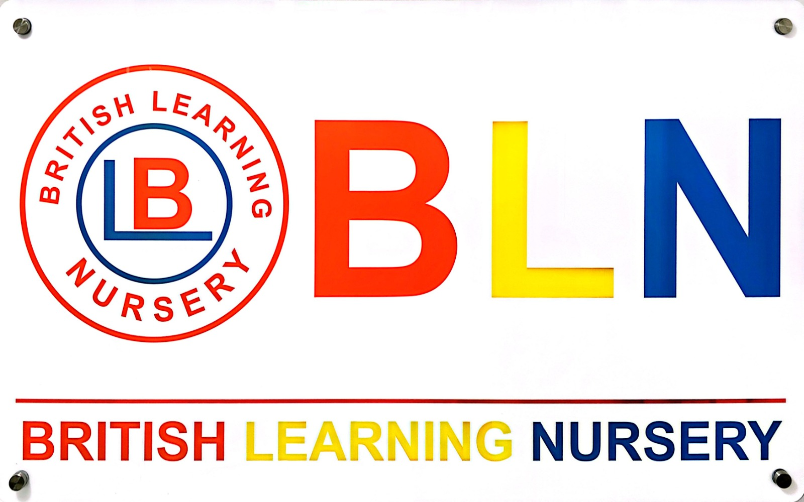

# British Learning Nursery

<p align="center">
  
</p>

<h1 align="center">BLN</h1>

<p align="center">
  <strong>British Learning Nursery</strong><br />
  <em>A joyful start to your child's learning journey</em>
</p>

<p align="center">
  Sabah Al Salem · Established 2008<br />
  British curriculum · Values · Sensory learning
</p>

<p align="center">
  <a href="https://linktr.ee/British_Learning_Nursery">Linktree</a>
  ·
  <a href="client">Frontend</a>
</p>

---

## Overview

An elegant, animated React landing page for **British Learning Nursery (BLN)** — a British nursery in Sabah Al Salem, Kuwait. Built to feel calm, colourful, and premium, with brand-true red, yellow, and blue accents.

This is a clean starter site: structure and polish first, with room to plug in full admissions, fees, gallery, and contact details later.

---

## Project structure

```text
British_Learning_Nursery/
├── client/                 # React + Vite frontend
│   ├── public/
│   │   ├── logo.png
│   │   └── incorporate.png
│   └── src/
│       ├── components/     # Header, Hero, sections, Footer
│       ├── data.js         # Site copy & links (edit here)
│       ├── App.jsx
│       └── index.css       # Brand tokens & global styles
├── server/                 # Backend (coming soon)
├── admin/                  # Admin panel (coming soon)
└── README.md
```

---

## Quick start

```bash
cd client
npm install
npm run dev
```

Open the local URL Vite prints (usually `http://localhost:5173`).

| Command        | Description              |
|----------------|--------------------------|
| `npm run dev`  | Start development server |
| `npm run build`| Production build         |
| `npm run preview` | Preview production build |

---

## Brand

| Token   | Colour | Use                          |
|---------|--------|------------------------------|
| Red     | `#E31E24` | British · accents · labels |
| Yellow  | `#F5C518` | Learning · highlights      |
| Blue    | `#00338D` | Nursery · CTAs · headings  |

**Typography:** Fraunces (display) · Outfit (body)

---

## Landing page sections

1. **Header** — frosted glass over hero, solid on scroll, mobile drawer  
2. **Hero** — full-bleed nursery façade, brand-forward title, soft motion  
3. **About** — story + feature highlights  
4. **Programs** — morning & evening placeholders  
5. **Curriculum** — four learning pillars  
6. **Facilities** — spaces overview + visual band  
7. **Admissions CTA** — register / WhatsApp  
8. **Footer** — visit, connect, enquire  

---

## Customise content

Edit a single source of truth:

```text
client/src/data.js
```

Update name, location, social links, programs, and curriculum copy there. WhatsApp / Instagram / TikTok currently point to the [official Linktree](https://linktr.ee/British_Learning_Nursery) until direct URLs are provided.

---

## Design notes

- Full-bleed cinematic hero with gentle image drift and brand colour wash  
- Header text stays readable: glass dark tint on hero, light bar when scrolled  
- Scroll reveals and staggered entrances via Framer Motion  
- Responsive from phone to desktop, with thumb-friendly CTAs  
- Respects `prefers-reduced-motion`

---

## Assets

| File | Purpose |
|------|---------|
| `client/public/logo.png` | Crest / BLN mark |
| `client/public/incorporate.png` | Building photograph for hero & sections |

---

## Roadmap

- [ ] Wire exact WhatsApp number & social profiles  
- [ ] Add fees, schedules, and admissions form  
- [ ] Gallery & testimonials  
- [ ] Arabic (AR) language toggle  
- [ ] `server` API + `admin` CMS  

---

<p align="center">
  <sub>© British Learning Nursery · Est. 2008 · Sabah Al Salem</sub>
</p>
